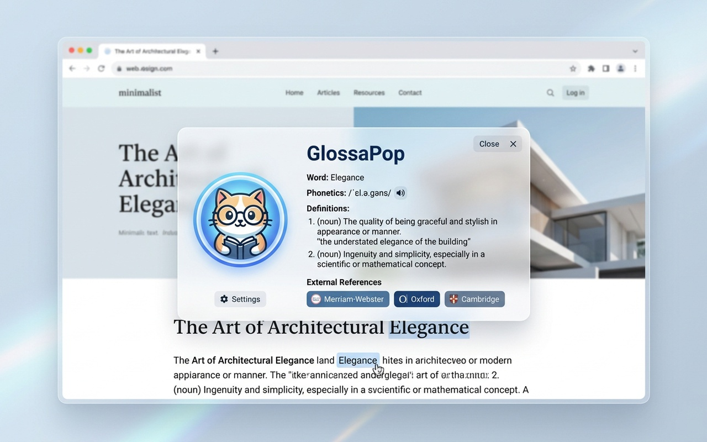

# GlossaPop

A modern, high-performance Chrome Extension built with Manifest V3 for floating translation popups. Select any word on a page to look up its definition in English or French instantly, complete with phonetics, audio pronunciations, grammatical conjugations, example sentences, and layout isolation.



---

## Key Features

- **Isolated Shadow DOM Popup**: Floats the popup in a clean Shadow DOM container, fully preventing the host website's styles (CORS, background styles, or font configurations) from corrupting the layout.
- **Premium Light Glassmorphism Design**: Rendered as a beautiful translucent white card (`rgba(255, 255, 255, 0.75)`) with a `24px` backdrop blur. The card width is optimized to `320px` to give contents and reference links ample breathing room.
- **WCAG AA Compliance**: All text elements (titles, definitions, and buttons) use high-contrast dark text. Example containers use a high-contrast dark clay/amber orange (`#b84a00`), meeting strict accessibility guidelines (over 4.5:1 contrast ratio against the white glass background).
- **Personalized Mascot Branding**: Displays a high-density circular orange cat logo wearing glasses next to the title in both the popup card and the settings options page.
- **Smart Language Auto-Detection**: Automatically detects if a clicked/double-clicked word is English or French. It queries Google Translate's auto-language detection in the background, updates the UI toggles dynamically, and loads the appropriate pronunciation engine.
- **Dynamic IPA Phonetics (English & French)**: Displays phonetic transcriptions side-by-side with the pronunciation button:
  - **English Phonetics**: Fetched from the Free Dictionary API.
  - **French Phonetics**: Fetched dynamically from the Wiktionary HTML API via a custom regex scraper that matches the French pronunciation IPA key (e.g. `/mɛ.zɔ̃/` for *maison*).
- **Multi-Tier Natural Audio Pronunciation Engine**: Speech playback is clear and natural, completely bypassing robotic default synthesizer voices:
  - **Tier 1 (Real Human Voice)**: Plays high-quality human recordings (MP3s) fetched from the Free Dictionary API for English.
  - **Tier 2 (Neural/Statistical Speech)**: Plays clear, natural neural speech using Google Translate's TTS endpoints for French and fallback words.
  - **Tier 3 (Localized Web Speech Fallback)**: Uses local `window.speechSynthesis` only as a final fail-safe, with strict filters matching the exact language locale (preventing English engines from reading French words) and a natural rate speed (`0.95`).
- **Inline Speaker Audio Positioning**: The main speaker pronunciation button and phonetic script are positioned side-by-side on the right side of the word title, saving vertical space.
- **Multilingual Example Sentences with Fallback**: Displays a short example sentence (and its translation) for each word. If the dictionary returns no examples, a triple-redundancy fallback queries Google Translate's public examples database followed by Tatoeba API, translating the sentence to your target language.
- **French Verb Conjugation Table (Present Tense)**: When a clicked French word is determined to be a verb, a dedicated blue-themed box appears displaying its complete present tense conjugation table for all grammatical persons (je, tu, il/elle, nous, vous, ils/elles).
- **Root Lemma & Derivation Parser**: Detects and displays the base form (lemma) for inflected words (e.g. past participles, plurals, gender variations). Common base words are protected by a strict first-definition heuristic to avoid false positive lemma matches.
- **External Dictionary Reference Links**: A dedicated row of external dictionary reference links is displayed at the bottom of the card. The links intelligently map to the base lemma form to ensure valid dictionary lookup:
  - **English**: Cambridge Dictionary, Merriam-Webster
  - **French**: Larousse, WordReference, French Assistant (法語助手)
- **Configurable Triggers**:
  - **Double Click**: Triggers the lookup immediately below the selected word.
  - **Text Selection**: Shows a non-intrusive float bubble; clicking it opens the card to ensure standard reading flows are not interrupted.
- **Premium Options UI**: Glassmorphism dashboard layout with auto-save updates synced instantly across all active tabs using the Chrome Storage Sync API.

---

## File Structure

The project follows a clean, single-responsibility modular structure:

```
GlossaPop/
├── assets/            # Project promotional screenshots and mockups
├── manifest.json      # Manifest V3 configuration settings & permissions
├── background.js      # Background router that dynamically imports service worker modules
├── bg-api.js          # Direct external API queries (Lingva, Google Translate, Tatoeba)
├── bg-parser.js       # HTML/JSON definition and example parsers for background queries
├── bg-dictionary.js   # Orchestrates dictionary flows, lemma lookups, and French phonetics
├── utils.js           # Shared utilities (escaping, French feminine derivation, conjugations)
├── audio.js           # Front-end audio pronouncer (Human MP3, Google TTS, Web Speech)
├── ui.js              # Scoped CSS styles tag and HTML card templates with mascot logo
├── settings.js        # Syncs and loads configuration options using chrome.storage.sync
├── events.js          # Cursor mouseup selections, double-clicks, and click-outside dismissal
├── content.js         # Main coordinator initializing Shadow DOM hosts and routing events
├── options.html       # Configurations page UI markup with circular mascot logo
├── options.css        # Premium dark glassmorphic styling for settings panel
├── options.js         # Settings manager linking inputs with chrome.storage.sync
├── icons/             # Contains extension icons and circular logo-cat.png mascot
├── CHROMEWEBSTORE.md  # Chrome Web Store submission metadata, descriptions & justifications
├── PRIVACY.md         # Privacy Policy declaration complying with developer guidelines
└── README.md          # Extension overview, file structure, and installation guide
```

---

## Installation Guide

Follow these steps to load GlossaPop on Google Chrome:

1. **Download/Clone** this repository directory to your local machine.
2. Open Google Chrome and enter `chrome://extensions/` in the address bar.
3. Toggle the **Developer mode** switch in the top-right corner to **ON**.
4. Click the **Load unpacked** button in the top-left corner.
5. Choose the `GlossaPop` root folder containing `manifest.json`.
6. GlossaPop is now active! You will see it listed under your active extensions.

---

## How to Use

1. Go to any public web page (e.g. Wikipedia).
2. Highlight a word using your mouse.
3. Click the magnifying glass icon that floats near your selection to open the lookup card.
4. Click the speaker icon next to the word to play the pronunciation.
5. Use the header switches (EN/FR and Chinese/English) to change source and translation outputs.
6. Open the **Extension Options** page by clicking details on the extension card or right-clicking the icon. You can switch the trigger mode to **Double Click** to display the popup immediately without the middle bubble step.

---

## APIs and Technologies Used

- **English Queries**: [Free Dictionary API](https://dictionaryapi.dev/)
- **French/Bilingual Queries**: [Wiktionary REST API](https://en.wiktionary.org/api/rest_v1/page/definition/) & [Wiktionary HTML API](https://en.wiktionary.org/api/rest_v1/page/html/) (French IPA extraction)
- **Example Fallbacks**: Google Translate Examples Database & [Tatoeba API](https://api.tatoeba.org/)
- **Audio Output**: Free Dictionary MP3s, Google Translate TTS API, and Web Speech API (`window.speechSynthesis`)
- **Storage Sync**: Chrome Storage Sync API (`chrome.storage.sync`)
