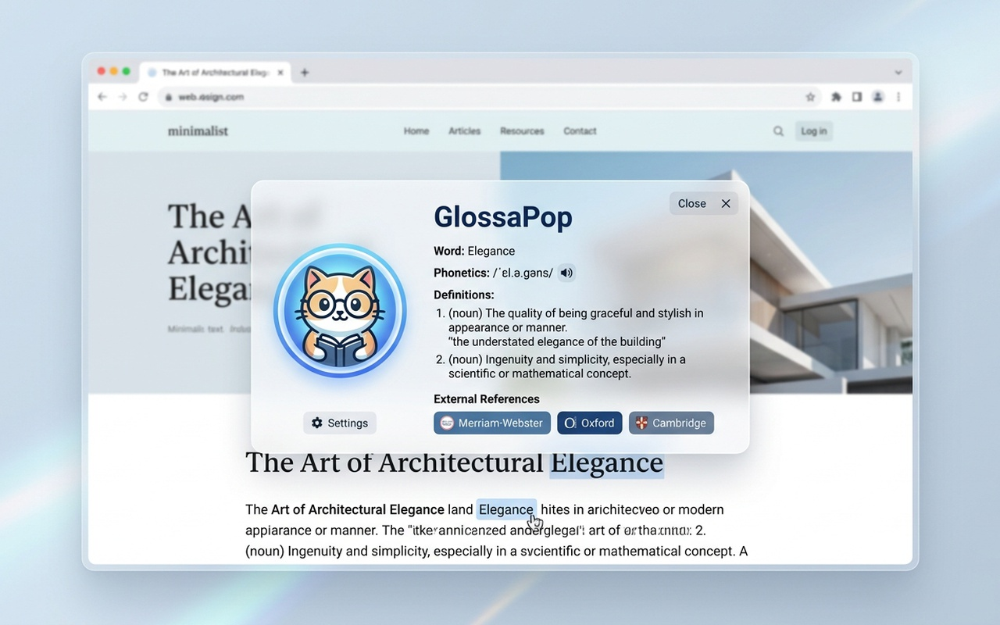

# GlossaPop

A modern, ultra-high-performance Chrome Extension built with Manifest V3 for floating dictionary popups and language learning. Highlight or double-click any word on a webpage to instantly look up definitions in your preferred explanation languages, featuring IPA phonetics, multi-tier audio pronunciations, a complete **18-tense 5-page French conjugation engine**, example sentences, dynamic reference links, **10-language Google Drive & Sheets cloud synchronization**, and complete Shadow DOM style isolation.

👉 **[Install GlossaPop on Chrome Web Store](https://chromewebstore.google.com/detail/kmamglgfhenmcomflbdmfjdnmnlkggad)**



---

## ✨ Key Features

### 🌐 Automatic Page Language Sensor & Multi-Language Support
- **Automatic Language Auto-Sensor**: GlossaPop automatically senses the host webpage language (Japanese, French, Spanish, German, Traditional Chinese, English, etc.) and routes dictionary lookups to the correct source engine without manual switching.
- **Glassmorphic Unified Source Dropdown & Quick-Switch Pills**: Header features a sleek unified `<select>` dropdown alongside quick-switch pill buttons (`[ FR ]`, `[ ES ]`, `[ DE ]`, `[ JA ]`, `[ EN ]`) styled with Apple-grade glassmorphism in light and dark themes.
- **Dual Target Explanation Toggles**: Easily switch between 2 customizable explanation languages (e.g. `[ 繁中 ] [ EN ]`) with a single click.
- **Bi-Directional Target Swap**: Options dashboard features `Explain 1` (Primary Target) and `Explain 2` (Secondary Target) mutually exclusive dropdowns with a 1-click bi-directional swap arrow button (`⇄`).
- **Language-Aware Dynamic Reference Links**: Automatically generates contextual dictionary links tailored to the lookup language:
  - **Japanese**: Jisho, Weblio, OJAD
  - **French**: Larousse, WordReference, CNRTL, French Assistant (法語助手)
  - **Spanish**: SpanishDict, RAE, WordReference
  - **German**: Duden, DWDS, Leo
  - **Korean**: Naver, Daum
  - **Italian**: Treccani, WordReference
  - **Portuguese**: Priberam, WordReference
  - **Traditional Chinese**: MoeDict (教育部重編國語辭典), WordReference
  - **English**: Cambridge, Oxford, Merriam-Webster

### 🇫🇷 Complete 18-Tense French Conjugation Engine (7,826 Verbs Offline Bundle)
- **7,826 Verbs LEFFF Standalone Browser Bundle (`lib/french-verbs-bundle.js`)**: Powered by `french-verbs` + `french-verbs-lefff` with 7,826 human-curated French verbs compiled into an offline browser bundle for 0ms 100% authoritative verb conjugations (e.g. *dormir* ➔ *je dors*, *tu dors*, *il dort*, *nous dormons*, *vous dormez*, *ils dorment*; and irregular derivatives like *endormir*, *pressentir*).
- **5-Page Tabbed Conjugation Pager (`‹ Page X/5 ›`)**:
  - **Page 1/5 (Indicatif Core)**: Présent, Passé C., Imparfait, Plus-que-p.
  - **Page 2/5 (Indicatif Advanced)**: Passé S., Passé Ant., Futur, Futur Ant.
  - **Page 3/5 (Subjonctif)**: Subj. Prés., Subj. Passé, Subj. Imp., Subj. P.Q.P.
  - **Page 4/5 (Conditionnel & Impératif)**: Conditionnel, Cond. Passé, Impératif, Impér. Passé
  - **Page 5/5 (Participe)**: Part. Prés., Part. Passé
- **Linguistically Accurate Compound Tenses & Formatting**:
  - Full auxiliary verb (*avoir* / *être*) resolution for compound tenses (*j’avais rappelé*, *que j’eusse rappelé*, *j’aurais rappelé*).
  - Exact Subjunctive elision formatting (`que je`, `qu’il`, `que nous`...).
  - Multi-tier resolution (Priority 1: 7,826 LEFFF bundle ➔ Priority 2: Kaikki API ➔ Priority 3: Wiktionary REST API ➔ Priority 4: Regular suffix rules).

### ✏️ Interactive Inline Word Editing & Draggable Popup Card
- **Inline Word & Sentence Editing (`contenteditable="true"`)**:
  - Hovering mouse over the word title displays an editing text cursor (`cursor: text`), light blue background highlight (`rgba(0, 102, 204, 0.08)`), and subtle dashed underline (`underline dashed`) as an intuitive visual affordance.
  - Pressing `Enter` or clicking outside (`blur`) automatically cleans accidental level suffixes and triggers an instant re-query for the edited word.
  - Dynamically updates secondary in-card CEFR badges (e.g., updating level badge from C1 to A1 upon editing word from *maisons* to *il*).
- **Draggable Popup Card (`makeCardDraggable`)**:
  - Drag card anywhere on the screen by dragging the top header bar (`cursor: grab` / `cursor: grabbing`).
  - Interactive header elements (close button, theme toggle, save button) automatically cancel drag motion to ensure seamless button clicks.
  - Viewport boundary safety handler automatically flips popup position above text selections when selected near the bottom edge of the browser viewport.

### ☁️ 10-Language Google Drive & Sheets Cloud Synchronization
- **1-Click Vocabulary Saving (`☆ Save` ➔ `★ Saved`)**: Save words directly to your personal Google Sheet with a single click.
- **10-Language Multi-Tab Architecture**: Intelligently categorizes words into dedicated language tabs:
  - `English Words`, `French Words`, `Spanish Words`, `German Words`, `Japanese Words`, `Korean Words`, `Italian Words`, `Portuguese Words`, `Traditional Chinese Words`, `Simplified Chinese Words`.
- **Dynamic Tab Creation (`ensureSheetExists`)**: Dynamically creates missing language tabs on-the-fly with frozen header rows if not already present in the user's workbook.
- **Full-Workbook Deduplication**: Displays `✓ Already in Vocabulary Book` by scanning all language tabs across the workbook.
- **1-Click Anki CSV Export**: Export saved vocabulary collections per language for Anki flashcards directly from the Options dashboard.
- **OAuth Silent Token Refresh**: Built-in 401 token expiration handler that silently refreshes OAuth credentials using `prompt=none`.

### 🛡️ Isolated Shadow DOM & Responsive Design
- **Shadow DOM Isolation**: Renders the floating popup card inside an isolated Shadow DOM container, preventing host webpage CSS (styles, fonts, background reset, CORS) from corrupting the UI layout.
- **Ultra-Responsive Options Dashboard (320px to 1200px+)**: Fully responsive Options page (RWD) that scales fluidly on iPad Pro (1200px max-width fill screen), desktop windows, and compact mobile viewports down to industry-standard **320px** without horizontal scrollbars or clipping.

### 🎨 Themes & WCAG AAA Accessibility Compliance
- **3-Tile Segmented Control Switcher**:
  - **🌗 Auto**: Matches OS system preferences (`prefers-color-scheme`).
  - **☀️ Light Glassmorphism**: Crisp translucent white card (`rgba(255, 255, 255, 0.75)`) with Apple System Royal Blue (`#0066cc`) badges.
  - **🌙 Dark Glassmorphism**: High-contrast sleek dark glass card (`rgba(19, 15, 36, 0.92)`) with neon gradient accents.
- **Accessible iOS/macOS Toggle Switch**: Accessible Google Account Connect/Disconnect toggle switch (`.toggle-switch`) with high-contrast text (> 4.5:1 ratio) and `:focus-visible` keyboard focus outlines (`#64d2ff`).

### 📚 Deep Dictionary & Linguistic Engine
- **Dynamic IPA Phonetics**:
  - **English Phonetics**: Fetched from Free Dictionary API.
  - **French Phonetics**: Extracted dynamically from Wiktionary HTML API regex parser (e.g. `/mɛ.zɔ̃/` for *maison*).
- **Multi-Tier Audio Pronunciation**:
  - **Tier 1 (Human Voice MP3)**: High-quality real human audio recordings for English words.
  - **Tier 2 (Neural Speech)**: Clear neural TTS audio via Google Translate API for French and fallback words.
  - **Tier 3 (Localized Web Speech)**: Fail-safe speech output via `window.speechSynthesis` with locale matching (`en-US`, `fr-FR`, `ja-JP`, `de-DE`, etc.).
- **Standard Dictionary Example Sentences**: Displays example sentences with target word highlighting. Queries Google Translate examples database and Tatoeba API as fallbacks.
- **CEFR Framework Level Badge**: Color-coded European language level badges (A1/A2 green, B1/B2 blue, C1/C2 purple).
- **Clickable Synonyms & Antonyms Chips**: Interactive tag chips under definitions; clicking any chip instantly queries that word inside the active popup card.

---

## 📁 File Structure

The project follows a modular, single-responsibility architecture:

```
GlossaPop/
├── assets/            # Project promotional screenshots and mockups
├── manifest.json      # Manifest V3 configuration, OAuth2 scopes & host permissions
├── background.js      # Background service worker router & message dispatcher
├── bg-api.js          # External API queries (Wiktionary, Lingva, Google Translate, Tatoeba)
├── bg-parser.js       # HTML/JSON definition and example sentence parsers
├── bg-dictionary.js   # Orchestrates dictionary flows, POS classification, and French IPA
├── bg-sheets.js       # 10-language Google Drive & Sheets API v4 engine, OAuth refresh & CSV export
├── utils.js           # Shared utilities (18-tense conjugation engine, LEFFF helper, language micro-sensor)
├── audio.js           # Front-end audio pronouncer (Human MP3, Google TTS, Web Speech)
├── ui.js              # Scoped CSS styles tag, 5-page pager UI, draggable card & editable word title
├── settings.js        # Syncs and loads configuration options using chrome.storage.sync
├── events.js          # Cursor mouseup selections, double-clicks, and click-outside dismissal
├── content.js         # Main coordinator initializing Shadow DOM hosts and routing events
├── options.html       # Configurations page UI markup with Google Sync & CSV Export buttons
├── options.css        # Premium dark glassmorphism responsive styling for settings panel
├── options.js         # Settings manager handling Google OAuth connection and options
├── icons/             # Extension icons and circular mascot logos
├── lib/               # Pre-compiled 7,826 French verbs standalone browser bundle
│   └── french-verbs-bundle.js
├── scripts/           # Build pipeline generator for compiling French verbs bundle
│   └── build_french_verbs_bundle.js
├── src/               # Entry source file for esbuild bundle generation
│   └── french-verbs-entry.js
├── tests/             # Categorized automated verification test suites (330+ checks)
│   ├── test_french_dormir.js    # 7,826 LEFFF bundle integration & prefix verb test suite
│   ├── test_editable_word.js    # Inline editable word title, hover text cursor & blur test suite
│   ├── test_draggable_card.js   # Draggable popup card header handle & viewport clamping test suite
│   ├── test_sheets_languages.js # 10-language Google Sheets title mapping & dynamic tab tests
│   ├── test_utils_refactor.js   # Morphological engine, LEFFF helper & browser fallback tests
│   ├── test_all_18_tenses.js    # 18-tense verb engine & 5-page pagination index tests
│   ├── test_languages.js        # Language matrix, audio locales, auto-sensor & dynamic links tests
│   ├── test_ui_options.js       # UI components, popup frame, theme switcher & RWD layout tests
│   ├── test_auth.js             # OAuth token expiration, 401 handling & silent refresh tests
│   ├── test_dictionary.js       # 100-word POS resolution, conjugations, CEFR & Wiktionary tests
│   └── test_fallback_chain.js   # Hybrid 3-tier dictionary fallback chain tests
├── CHROMEWEBSTORE.md  # Chrome Web Store submission metadata, descriptions & justifications
├── PRIVACY.md         # Privacy Policy declaration complying with developer guidelines
└── README.md          # Project overview, feature list, and installation guide
```

---

## 🚀 Installation Guide

### Option A: Install from Chrome Web Store (Recommended)
Visit the official [GlossaPop Chrome Web Store Page](https://chromewebstore.google.com/detail/kmamglgfhenmcomflbdmfjdnmnlkggad) and click **Add to Chrome**.

### Option B: Load Unpacked (Developer Mode)
1. **Download/Clone** this repository to your local machine.
2. Open Google Chrome and enter `chrome://extensions/` in the address bar.
3. Toggle the **Developer mode** switch in the top-right corner to **ON**.
4. Click the **Load unpacked** button in the top-left corner.
5. Choose the `GlossaPop` root folder containing `manifest.json`.
6. GlossaPop is active! You will see it listed under your Chrome extensions.

---

## 💡 How to Use

1. Go to any webpage (e.g. Wikipedia, news sites).
2. Highlight a word or phrase with your mouse cursor.
3. Click the floating magnifying glass icon (or double-click if configured) to open the dictionary card.
4. Click **`☆ Save`** to save the word directly to your Google Sheet (`★ Saved`).
5. Click the speaker icon to play natural audio pronunciation.
6. Hover over the word title in the card header (displays text editing cursor & dashed underline) to click and edit any word or sentence, then press `Enter` or click elsewhere to re-query.
7. Drag the card header bar (`cursor: grab`) to move the popup anywhere on the screen.
8. Use the header language select dropdown or quick-switch pills (`[ FR ]`, `[ ES ]`, `[ DE ]`, `[ JA ]`, `[ EN ]`) to switch source languages.
9. Open **Extension Options** by right-clicking the GlossaPop extension icon and selecting **Options**. Here you can manage Google Cloud Sync, toggle appearance themes, and export Anki CSV files per language.

---

## 🧪 Automated Testing

GlossaPop includes a comprehensive 330+ check categorized automated test suite built on Node.js:

```bash
# Run all 11 categorized test suites
npm test
```

---

## 🛠️ APIs & Technologies Used

- **French Verb Morphology Engine**: [french-verbs](https://www.npmjs.com/package/french-verbs) & [french-verbs-lefff](https://www.npmjs.com/package/french-verbs-lefff) (7,826 verbs offline database)
- **Google Drive API v3 & Sheets API v4**: 10-language real-time cloud sync & spreadsheet management (`https://www.googleapis.com/auth/drive.file`)
- **English Queries**: [Free Dictionary API](https://dictionaryapi.dev/)
- **French & Multilingual Queries**: [Wiktionary REST API](https://en.wiktionary.org/api/rest_v1/page/definition/) & [Wiktionary HTML API](https://en.wiktionary.org/api/rest_v1/page/html/)
- **Example Sentence Fallbacks**: Google Translate Examples Database & [Tatoeba API](https://api.tatoeba.org/)
- **Audio Output**: Free Dictionary MP3s, Google Translate TTS API, and Web Speech API (`window.speechSynthesis`)
- **Storage & State Sync**: Chrome Storage Sync API (`chrome.storage.sync`)
